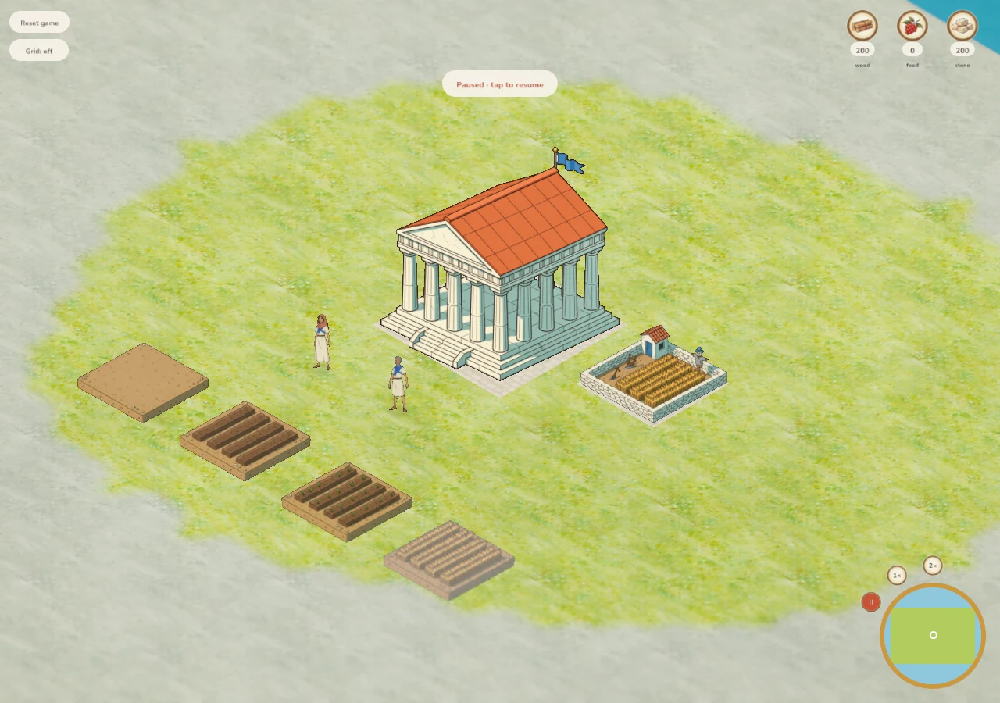
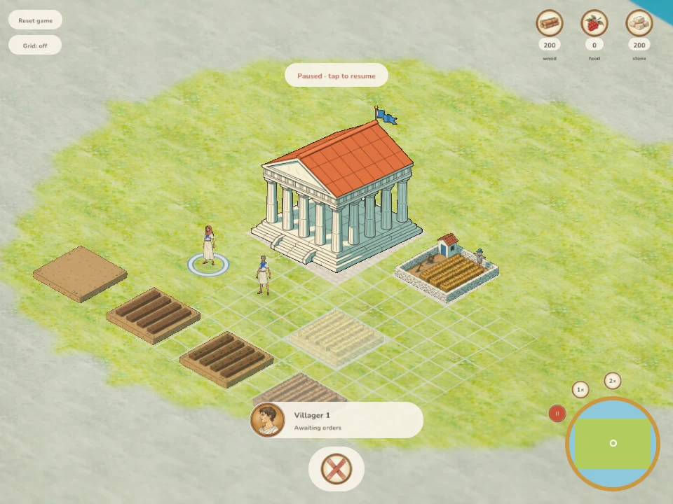

# Custom field art review

Fields previously rendered the farm building's four frames, including its shed and walls. Dedicated fal-generated cleared soil, cultivated furrows, small seedlings and ripe wheat now render on the existing 3×3 resource footprint. The Field coin and placement ghost use the ripe frame. Depletion returns to cleared soil; preparation thresholds remain at one-third and two-thirds of paid work.

## Structure

- Extracted the existing uniform ground-corner fitting calculation into `buildings::on_plot`, so fields reuse its geometry, depth and anchoring without pretending to be farm buildings. Existing building sizing, foundation fill and house scale stay unchanged.
- Appended one row to the existing economy atlas. No new runtime request, texture binding, shader, client dependency, engine layer or interaction mode. The atlas grows from 2048×2048 to 2048×2560, within WebGL2's minimum 4096 texture dimension.
- Field stages share one source crop, scale, base corners and plot fill. A focused rendering regression covers empty/preparing/ripe states, threshold boundaries, stable anchors and sizes, footprint containment and matching preview art. Existing building geometry tests exercise the shared calculation.
- Commands, costs, saves, occupancy, timing and harvest logic remain entirely in the unchanged game crate. Idle villagers gain no behavior. Mouse and touch retain the same placement path.
- No client file crosses 1,000 lines. Changes are confined to field art, shared fitting, its menu/preview consumers, provenance and documentation.

## Art

Four 1024px source renders and fal BiRefNet cutouts are retained with prompts and request IDs. The final 512px cells are downsampled without upscaling. Source-ground registration is shared; pale blue/cream/dark-green matte checks show clean edges. Sprites are genuine RGBA PNGs with transparent corners. Original economy building rows compare pixel-for-pixel equal. The first tall seedling iteration was rejected in favor of sparse short sprouts generated from the cultivated frame.

## Verification

All 152 workspace tests, formatting, strict native/WASM lint, asset checks and deterministic repacking pass. The integrated release WASM is rebuilt. Desktop mouse and DPR-2 phone touch placement each reserve exactly 10 wood + 5 stone and create distinct fields. Desktop captures confirm the dedicated menu coin, ripe ghost and cleared plot; the phone stage gallery confirms its art at device scale. Final release status is recorded in `OPEN_WORK.md`. Browser evidence is stored under `/workspace/scratch/field-art/` for desktop and a DPR-2 390px phone. The existing repository-wide HD audit still reports older villager/military gaps; all four new field cells meet the 512px requirement.

