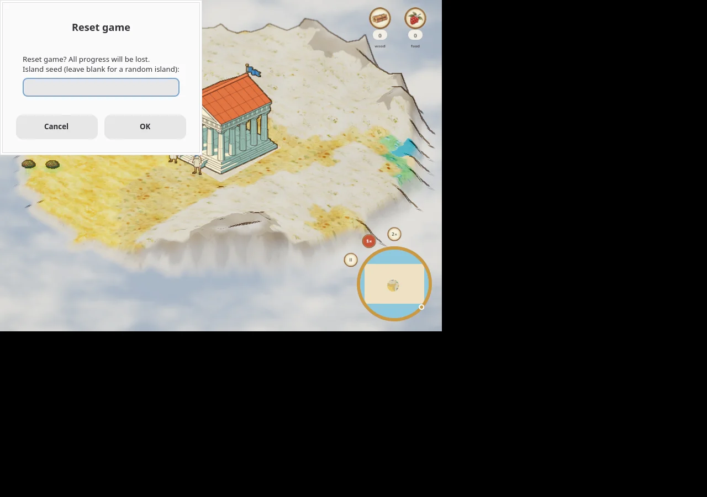
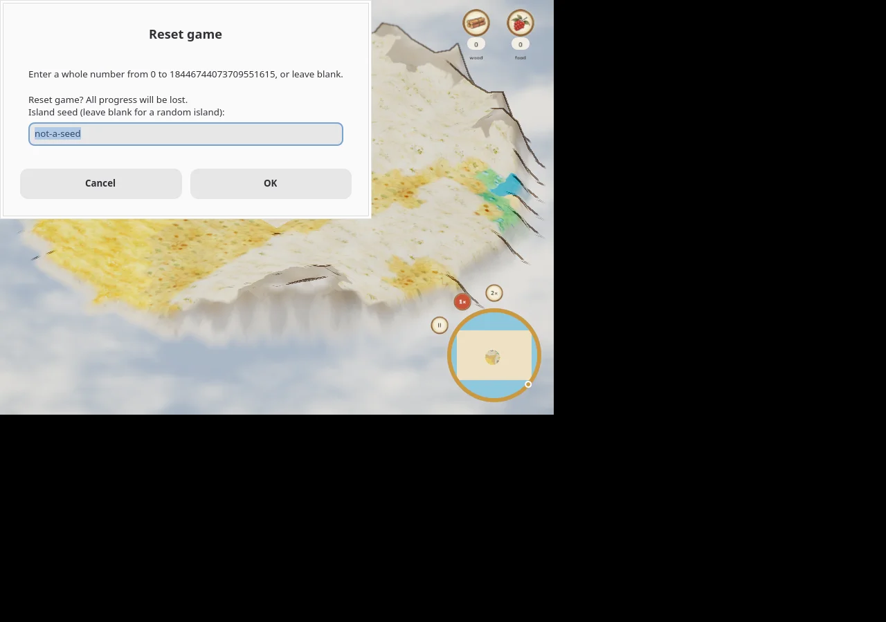
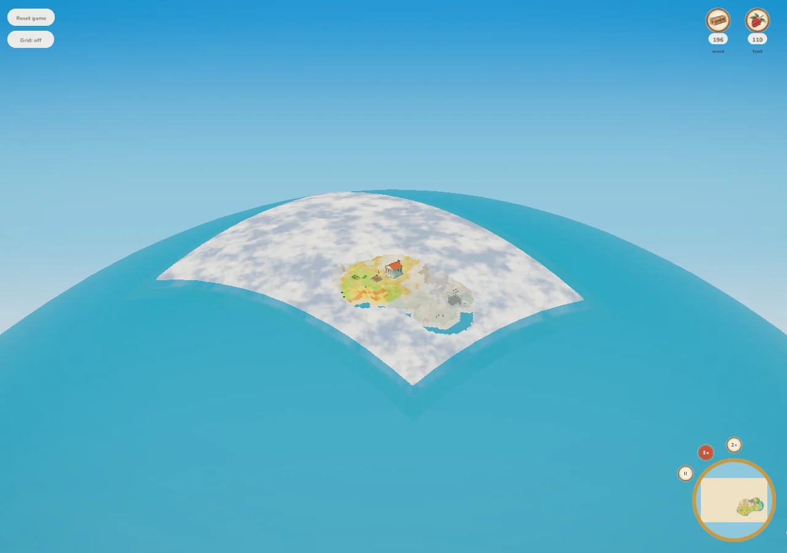
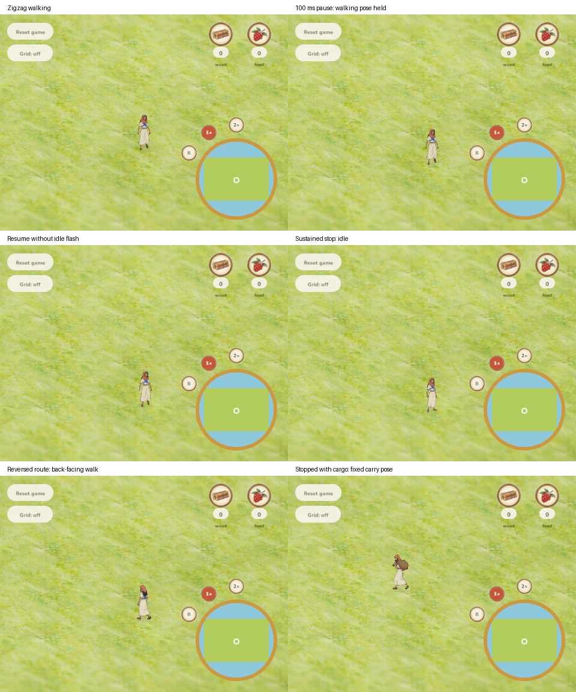

# Presentation verification — 2026-10-03

This follow-up records the three presentation checks previously missing from the handoff. Evidence is checked in under [verification/2026-10-03](verification/2026-10-03), so it does not depend on another session's `/tmp` files. No gameplay, renderer, asset source, or saved-world changes are part of this PR.

## Native reset dialog

Verified the actual `age-of-agents-client` on Linux using Xvfb, Mesa lavapipe and Zenity 4.1.90. Built from `81db5b7` with `cargo build -p aoa-client --locked`; launched with `AGE_OF_AGENTS_SEED=123`. This is the real HUD → `choose_seed` → `tinyfiledialogs` path, not a separately reconstructed dialog. Temporary display/helper packages were extracted outside the repository.

- Click **Reset game**: the progress-loss warning, blank-for-random instruction, editable seed field, and Cancel/OK controls are legible and unclipped.
- Enter `not-a-seed` and press Enter: the retry displays the complete `u64` range, retains/selects the invalid text, and keeps the warning and controls visible.
- Press Escape: the dialog closes and the seed-123 island remains visible.
- Reopen, enter `42`, and press Enter: the dialog closes and the client renders the different island.




[Cancelled reset](verification/2026-10-03/native-reset-cancel.webp) · [Confirmed seed 42](verification/2026-10-03/native-reset-42.webp)

Platform scope: Linux/Zenity appearance is verified. This is not a macOS or Windows appearance claim. The virtual display has no window manager, so desktop placement/decorations are not representative. Native simulation is in-process; no production reset or existing SQLite save was used.

## Deployed globe view

Independently opened [production `/play`](https://koogle-frick--age-of-agents-web.modal.run/play) in Chromium at 1280×900. This used the hosted WebSocket world and remotely served assets/WASM, not `?local` or a localhost mirror. Only camera wheel events were sent; no production gameplay commands or resets.

The original [globe release run 37142115461](https://github.com/koogle/age-of-agents/actions/runs/37142115461) completed successfully for `787de2629050db8ba196fe24bf49cb399fdbcab9`. The live WASM fetched during this check had SHA-256 `d614dbf1c60aeb95dcb02703103c0285f29d09f7a20d2949283f33ea3525e92e`. Other releases were queued/running; this check does not certify those later releases.

- Settlement view loads and displays its buildings, terrain and fog.
- Repeated wheel-out reaches the distant curved horizon; unexplored terrain remains cloud-covered.
- Wheel-in returns to close settlement rendering without a blank canvas or clipping away the visible building.
- No JavaScript page errors were reported during loading or the out/back sequence.



[Initial settlement view](verification/2026-10-03/live-globe-near.webp) · [Return to close zoom](verification/2026-10-03/live-globe-return.webp)

Existing local desktop/phone globe checks remain separate evidence. This follow-up adds the missing live desktop check; it does not claim a fresh live-phone check, newly discovered islands, or verification of unrelated releases.

## Browser villager direction and pose hold

Verified the checked-in release WebGL bundle at `c9b6d6c` in Chromium, using a loopback-only snapshot replay. WASM SHA-256: `19593558147d506a944720fa2d367bb735fad80841c4ef209c41d70bf42a637a`. The fixture has one villager on flat visible ground and alternates positive X/Y movement every 100 ms, pauses for one snapshot, resumes, stops for two seconds, reverses, then carries seven wood and stops again.

This isolates presentation from pathfinding and economy. It exercises the real snapshot decoder, interpolation, direction smoothing, sprite selection and WebGL drawing. It is not an end-to-end navigation or working-animation test. No production connection, command, or saved-world mutation is involved.

Software rendering was too slow to resolve a 100 ms pause reliably in wall time. The final run therefore used Playwright's paused clock, advancing 100 ms per snapshot with animation frames between ticks. Screenshots do not advance that clock. A read-only wrapper around WebGL `bufferSubData` recorded the one-villager sprite anchor and UV rectangle; no application debug hook or gameplay change was added.

Results from [1,275 recorded sprite uploads](verification/2026-10-03/zigzag-samples.json):

- The initial heading settles once, then the 4.8-second zigzag and two-second resumed route retain the same front/mirror direction, without alternating direction at each bend. The reversed route changes to the back-facing view and holds it.
- The 100 ms pause never selects idle. Samples 157–189 ms after pause onset have identical position and walk-frame UVs: the stride freezes while interpolation reaches the pause, rather than walking in place.
- A sustained stop transitions to idle 313 ms after the first stationary snapshot (including interpolation lag), and stays idle.
- Carrying uses the carry sheet; the settled final stop retains a single carry-frame UV for the remaining 1.5 seconds, with no idle swap or in-place stride.
- Screenshots visually confirm the walk, held pause, idle, reverse and carry poses. No JavaScript page errors occurred.



Reproduce from the repository root with Python `aiohttp`, `playwright`, and Chromium installed:

```bash
python docs/verification/replay_presentation.py --output /tmp/aoa-presentation-check
```

The [replay driver](verification/replay_presentation.py) and [presentation fixture](verification/presentation-fixture.json) are saved with the evidence. It serves checkout assets on loopback port 8001 and writes screenshots plus timestamped sprite uploads. Its assertion checks capture availability and page errors; the behavioral conclusions above come from reviewing the screenshots and recorded UV/position sequence. Atlas/layout changes require revisiting the upload decoder.

## Review and checks

All 43 client tests, `cargo fmt --all --check`, and strict native client Clippy passed. Native client/server builds passed. Python syntax/help and documentation links/whitespace were checked. No runtime source or generated WASM changed, so no WASM rebuild was needed for this evidence-only change.

Thermonuclear review: no new gameplay behavior, dependencies in the application, rendering abstraction, save migration, or generated game art. The replay remains an isolated verification aid, not a production subsystem. Evidence is scoped by platform, deployed bundle and local bundle; unrelated release checks remain in the backlog. The authorized merge uses the repository's existing quality/deployment workflow.
