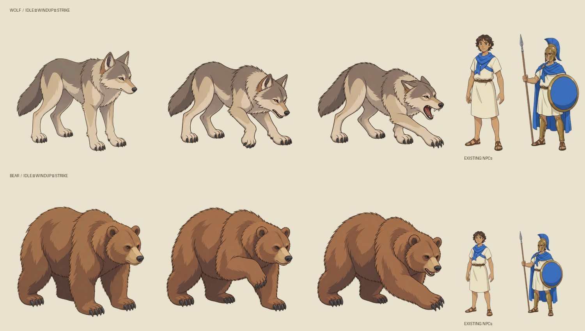
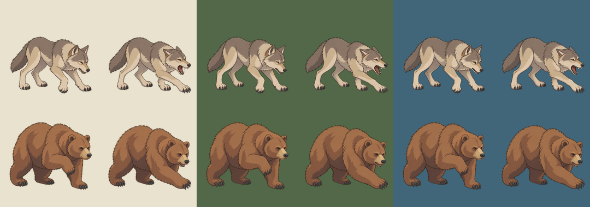
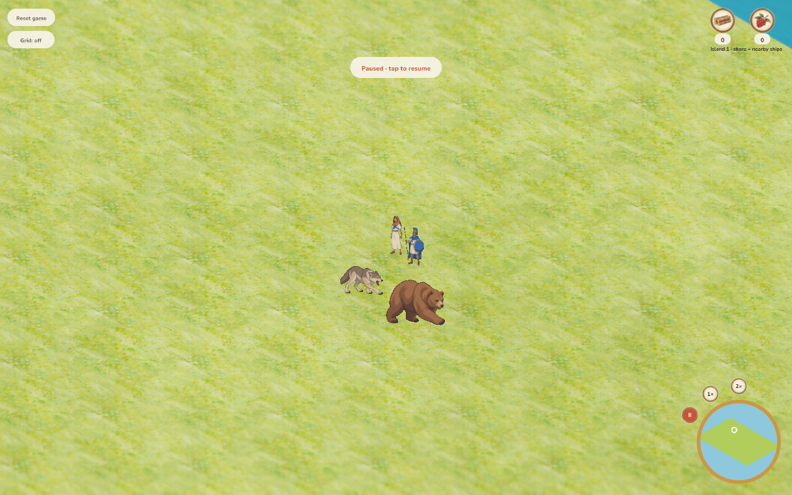
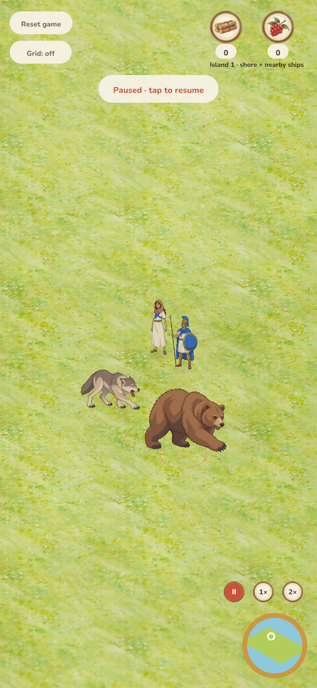
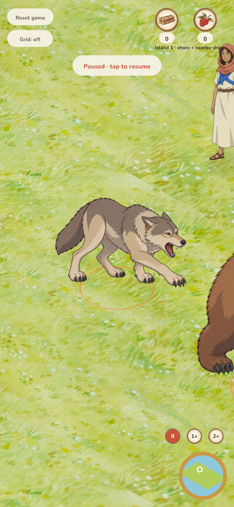
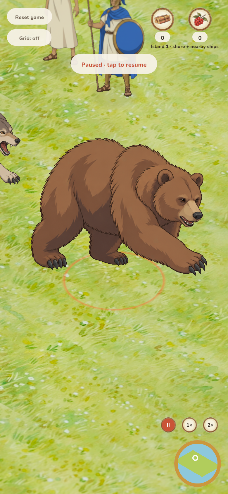
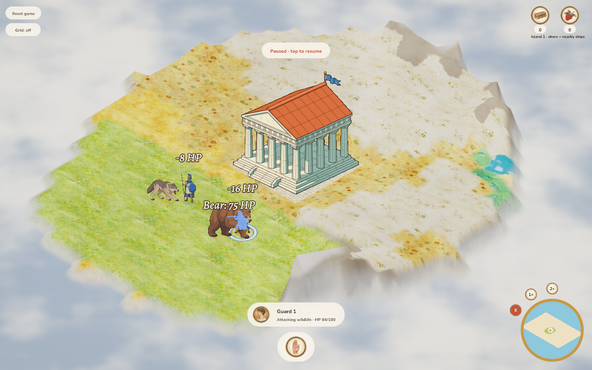
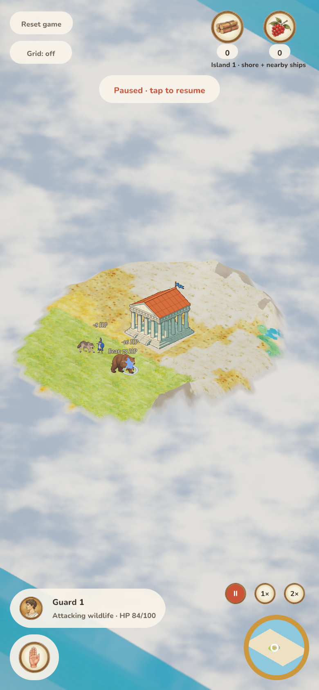

# Authored wolf and bear attack frames

Extension of PR #130 from `8fca242`, requested by Jakob on 2026-10-05.

The animal atlas now includes wolf bite and bear swipe windup/strike poses.
The original four idle/walk cells are preserved pixel-for-pixel in columns 0/1;
new columns 2/3 are authored attack poses. Atlas: 2508×1254, eight 627px cells.

 (removed 2026-10-10: iteration evidence; final state kept)

## Art and registration review

Approved references: NPC-matched animal source, shipped villager idle art and
original guard art. Exact generation prompt, source path and reference hashes
are retained in `assets/sprites/wildlife_sources/npc-attack-provenance.json`.

| Criterion | Finding |
| --- | --- |
| Ink — pass | Same fine warm brown contours and sparse fur accents as idle and the NPCs. |
| Color — pass | Wolf warm grey/limestone and bear umber remain consistent across all poses. |
| Light/material — pass | Broad restrained cel-lit and shadow shapes; no dense fur or glossy rendering. |
| Shape — pass | Wolf braces then opens its jaws/reaches; bear lifts one forepaw then swipes. Both stay grounded, with four coherent limbs and the same identity. |
| Camera/scale — pass | Same three-quarter right-facing camera and common 589/627 packing scale. Attacks align by planted rear-paw landmarks, not the moving front paw. |
| Alpha — pass | Inspected on parchment, dark green and blue; no visible matte or colored fringe. |
| Integration | Pass: desktop and DPR-2 phone rendered pose/mirroring/pause checks pass, and normal/maximum-zoom captures show coherent anatomy, clean edges and stable identity. |

The generated source is 1254×1254 despite requesting 2048×2048; its original
627px cells exceed the 512px minimum. No source is enlarged. The packer checks
safe bounds and writes both the atlas and manifest.

## Runtime behavior

The existing authoritative `attack_seconds` timer selects windup below 0.6s
and strike from 0.6s onward. Its reset at a hit supplies an idle recovery beat.
A moving animal uses locomotion. The client does not infer attacks from nearby
units or run a separate combat clock; paused snapshots retain the pose.
Animals update heading toward the target on clear melee contact, including when
they were already adjacent and never walked first. Combat cadence, damage,
territory, orders and save format remain unchanged.

## Verification and structural review

- 266 Rust tests pass (one existing manual benchmark ignored), including actual
  drawn UVs against the authored manifest, both species and mirrored facings,
  frozen snapshot poses independent of wall time, locomotion replacing a stale
  attack phase, stationary facing and phase reset on retreat.
- Formatting and strict native/WASM lint pass; web client and debug server rebuilt.
- All 302 frames pass the sprite resolution audit. Original idle/walk pixels
  compared against the pre-extension atlas and confirmed unchanged.
- Browser replay passes on desktop and DPR-2 phone: actual rendered windup, strike, recovery and mirrored UVs match the authored cells; paused pose/anchor arrays remain unchanged. Real-server mouse/touch hunting also passes, including damage in both directions, bear defeat/cleanup and zero page errors.

The change uses the existing combat timer and snapshot format. It adds no
runtime dependency, new gameplay state, proximity heuristic or UI interaction.
The only simulation change is presentation heading toward an already-selected
legal melee target. The renderer remains presentation-only.

`python3 docs/verification/replay_animal_attacks.py --output docs/verification/2026-10-05-animal-attacks`
serves controlled paused snapshots on loopback :8013, observes actual uploaded
WebGL instance UVs, and captures windup, strike, recovery and mirrored poses in
1280×800 DPR1 desktop and 390×844 DPR2 phone viewports. It also captures both
strikes at the true camera minimum distance. It does not establish combat rules.
`verify_wildlife.py` runs the separate real-server mouse/touch combat acceptance.

Limits: two attack poses plus existing idle recovery, mirrored for left/right;
no authored reverse-facing set. Phone evidence is emulated, not a physical device.
Merge explicitly authorized on 2026-10-06; release uses the merge-triggered GitHub Actions workflow.

The presentation fixture spaces NPCs behind the animals so their combat
silhouette overlays cannot obscure the reviewed paws/jaws. Maximum-zoom framing
uses a deliberate drag beyond the input threshold before zooming, preventing a
near-center subject from accidentally selecting an NPC instead of panning.

 (removed 2026-10-10: iteration evidence; final state kept)

[Timing preview](attack-cycle.gif) assembles authored cells with the runtime
recovery/windup/strike durations; it is an asset preview, not a browser recording.

 (removed 2026-10-10: iteration evidence; final state kept)
 (removed 2026-10-10: iteration evidence; final state kept)

 (removed 2026-10-10: iteration evidence; final state kept)
 (removed 2026-10-10: iteration evidence; final state kept)

 (removed 2026-10-10: iteration evidence; final state kept)
 (removed 2026-10-10: iteration evidence; final state kept)

Rendered instance records and the rebuilt WASM hash are in `results.json`;
authoritative combat observations are in `live-combat-results.json`.

## Authorized integration — 2026-10-06

Integrated master `faa4b04`, preserving terrain generation, productive building
availability, granary yield and menu icons. No source conflicts; handoff notes
were combined and JS/WASM rebuilt from the merged source. All 278 tests pass
(one existing benchmark ignored), formatting, strict native/WASM lint, 302-frame
asset audit, field/transport/icon checks and six release-verifier tests pass.
Real-server desktop mouse and DPR-2 phone touch hunting, mutual damage, defeat
and cleanup pass with no page errors (`merged-combat-results.json`).
Combined WASM SHA-256: `634a987735886a3f568d718bcf66749c02897c91280271ae8ce5b9beedb0da27`.
