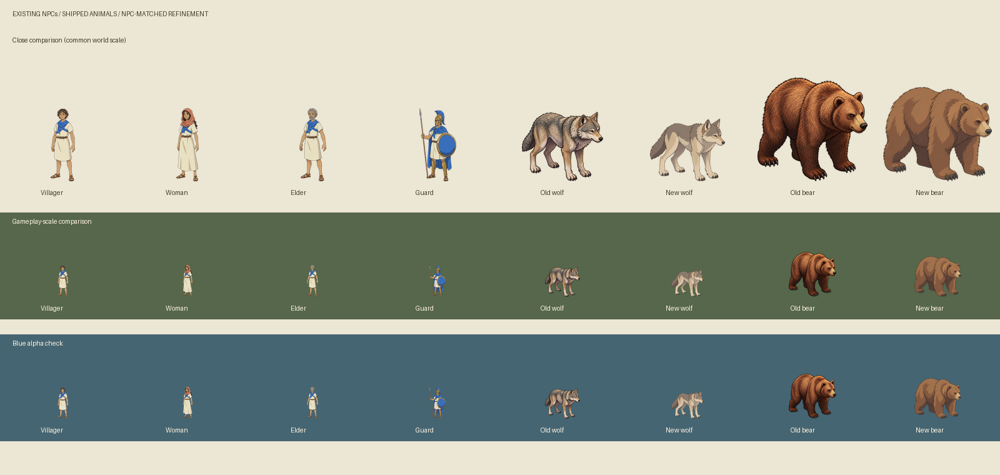
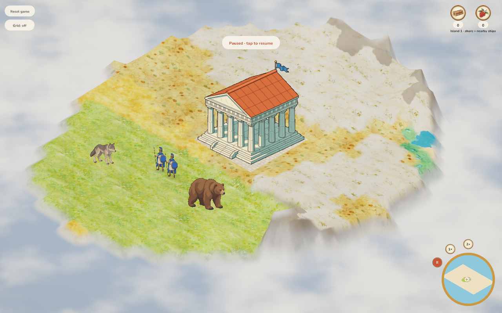
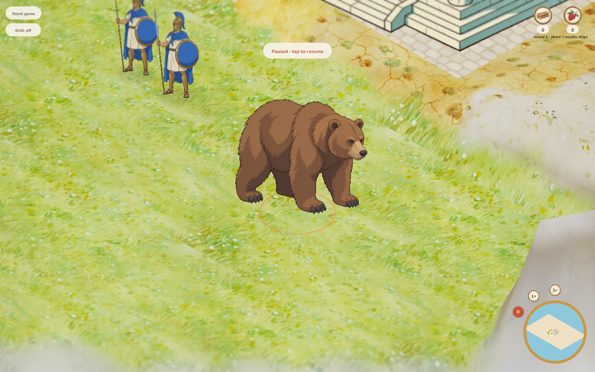
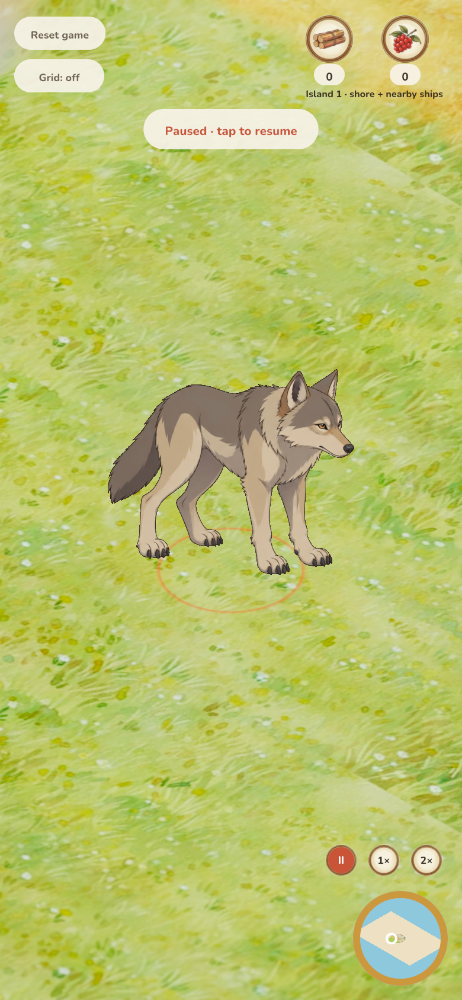
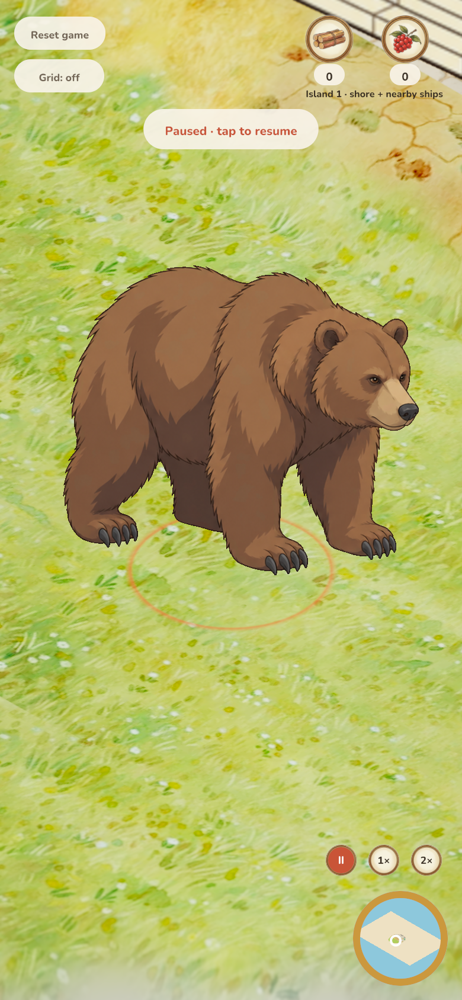

# NPC-matched wildlife style review

Base: `079d34864c7acfcfca9cf5fd84f3469a076ea95d`, 2026-10-05.
Scope: replace four wolf/bear idle/walk images and register their paw baselines.
No simulation, interaction, save or camera changes.

## References and comparison

Approved sources: `assets/reference/diorama_primary.webp`, shipped
`assets/sprites/villager_idle_hd.png`, and
`assets/sprites/hd_sources/units/guard_idle_front_cut.png`. The comparison uses
the actual shipped guard atlas cell as well as all three villager identities.

`python3 docs/verification/2026-10-05-animal-style/comparison.py` reproduces the
comparison from retained files, with the renderer's sprite-to-world ratios at
150 and 65 pixels/world unit. This is a contact sheet, not an in-game screenshot.
The old atlas remains in `wildlife_sources/refined.png`.

## Style acceptance

| Criterion | Finding |
| --- | --- |
| Ink — pass | Fine warm brown contours now resemble NPC clothing/limb lines; removed dense black fur etching. |
| Color — pass | Wolf grey/limestone echoes NPC cream cloth and muted hair; bear uses restrained umber rather than the original strongly lit orange fur. |
| Light/material — pass | Broad cel-lit and shadow areas match the NPC family; first faceted-brush pass was rejected and retained. |
| Shape/detail — pass | Lean alert wolf and heavy round-shouldered bear remain distinct; sparse tufts retain species texture without filling the body with small marks. Four legs and modest walk poses retained. |
| Camera/scale — pass | Same right-facing three-quarter view, identity and shared scale per pair. All poses now use a common 590px paw baseline. Common 0.9394 source packing scale adds safe margins; world dimensions remain 0.95/1.3. |
| Alpha — pass | Inspected on dark green, parchment and blue; no white rectangular matte or visible colored fringe at display sizes. |
| Runtime integration | Pass: desktop and DPR-2 phone gameplay and true maximum-zoom captures inspected; consistent with guards/buildings, crisp silhouettes, no visible cutout fringe. Mouse/touch hunting checks pass. |

## Verification and review

264 Rust tests pass (one existing manual benchmark ignored), formatting and strict native/WASM lint pass. WebAssembly and the debug server were rebuilt from this source. All 298 sprite frames pass the resolution/alpha audit; all four wildlife baselines equal 590 and have safe bounds. Six existing release-verifier tests pass, Python sources compile and relative documentation links resolve. Desktop mouse and DPR-2 phone touch hunting, mutual damage, defeat/cleanup and zero page errors passed. Maximum-zoom capture repeated after correcting the wheel-event clamp assumption: eight wheel events reach the minimum camera distance from the full zoom range.

Rebuilt WASM SHA-256: `9556a505b1ffd3ad0013557d92a40ee57449627e4cc8bcd9efcfe19edae5b6ab`. The structural review removed the four
per-pose paw constants by registering the source cells to one shared baseline.
No new runtime dependencies, gameplay states, data migration or UI paths.

Limits: mirrored idle/walk frame scope remains; reverse facings and dedicated
attack art were not introduced. Contact-sheet comparisons do not prove animation
integration, native OS appearance or physical-phone behavior.

## Browser procedure

`python3 docs/verification/verify_wildlife.py --output docs/verification/2026-10-05-animal-style --closeups`
uses an isolated local SQLite world and rebuilt server/WASM. Desktop is 1280×800
at DPR 1; phone is an emulated 390×844 viewport at DPR 2. The fixture puts two
guards near both species on flat terrain. It captures normal and minimum-camera-
distance views, then orders hunting with actual mouse/touch input and checks
mutual damage, bear defeat, cleanup and browser errors. Maximum-zoom framing
uses emulated mouse pan/wheel on both viewports; phone hunting uses touch.

## Release status

Not merged or deployed. Direct Modal profile selected `radiantai`, whereas the
repository documents `koogle-frick` as production. Profile listing also failed
to connect. No attempt was made to deploy to the differently selected account.

