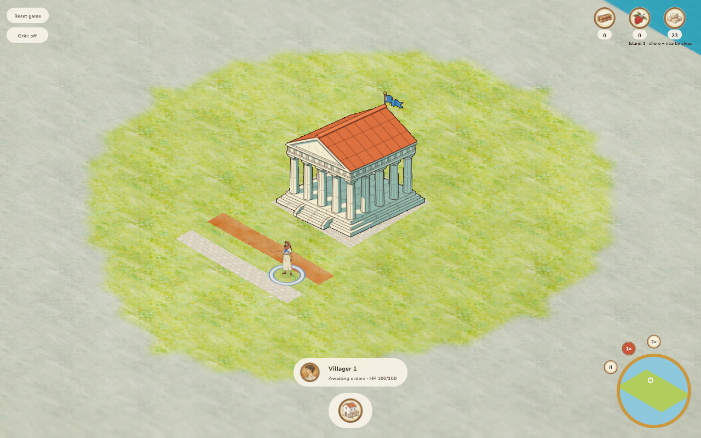
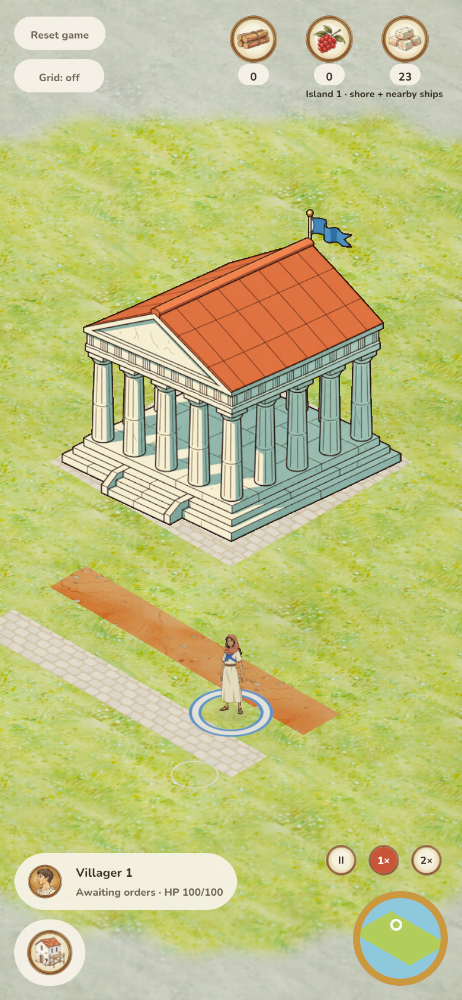

# Basic roads verification — 2026-10-05

Roads are walkable surfaces with explicit villager work. Dirt costs only labour;
stone adds one stone per new cell. Both take two worker-seconds per cell and grant
1.5× friendly movement after completion. Each order is an inclusive horizontal or
vertical segment; mixed-material crossings reuse existing cells. Animals retain
their original routes and speeds.

## Reproduce

```bash
cargo test --workspace --locked
cargo clippy --workspace --all-targets --all-features --locked -- -D warnings
cargo clippy -p aoa-client --target wasm32-unknown-unknown --locked -- -D warnings
cargo fmt --all --check
cargo build -p age-of-agents --locked
cargo build -p aoa-game --example roads_fixture --locked
./scripts/build_web.sh
python3 docs/verification/check_roads.py --output /tmp/road-check
```

The browser driver needs a Python environment with `aiohttp` and `playwright`
and an installed Chromium. In the managed workspace, use the default Python;
cloud activation for Cargo can select a different Python without these packages.

The driver creates an isolated temporary SQLite save and server on loopback
port 8000. It refuses to start when that port is occupied and never opens the
configured or production database. It uses a flat, visible settlement from
`crates/game/examples/roads_fixture.rs`, Chromium software WebGL, desktop mouse
(1280×800 DPR1) and emulated phone touch (390×844 DPR2). Phone endpoints are
shifted four cells east to keep endpoint taps inside its narrow viewport.

It selects a villager, opens Build → Roads, places seven dirt cells and seven
stone cells through real inputs, checks dominant-axis snapping, waits for
authoritative completion, verifies stone stays at 30 then falls to 23, and
checks exactly two build-road commands with no browser errors. It waits for
rendered frames after authoritative completion before clicking the now-idle
Build control: a short wall-clock sleep under software WebGL can still leave
the previous Build/Stop layout on screen and click Stop accidentally.

## Checks

Combined with master `f985a92`, retaining the approved productive-building
availability gate, granary field-yield bonus, dedicated menu icons and wildlife
attack art. The Roads category retains its Build icon; all four building category
icons and Back navigation use the newly integrated artwork.

- 289 Rust tests pass; one existing manual archipelago benchmark is ignored.
- Native/WASM strict lint, formatting, rebuilt WASM and native server pass.
- Sprite resolution, field/transport assets and icon normalization pass. Six
  release-verifier tests pass. Existing generated assets are reused unchanged.
- Desktop mouse and DPR-2 phone touch both pass against the `8bf00b4` integration,
  without browser errors. [Result hashes](results.json) identify the server and WASM.
  The screenshots below show that build. The later granary-only integration is
  covered by the full Rust suite and a final desktop construction replay; see
  [granary integration results](granary-integration/results.json).
- The final `f985a92` menu/wildlife integration passes both desktop mouse and
  DPR2 touch construction replays without new screenshots; the approved road
  textures are byte-identical. [Combined build results](merge-integration/results.json).

## Visual review

**Updated 2026-10-06:** the user requested closer style matching. Dedicated road
materials replace the original reuse below; see the [current refinement and
visual evidence](style/README.md). The following screenshots retain the original
construction verification and are historical material previews.

### Original material pass

The original pass used approved clayland paint for dirt and the existing
cobblestone swatch for stone. These retained the terrain lighting, fog and
perspective. At that stage there was no new generated art or asset editing. Ink/material match was inherited
from those swatches; straight boundaries are deliberate grid edges. The existing
Build and stone medallions retain the approved palette and scale, with explicit
Dirt road / Stone road labels. Retained captures: [desktop before](desktop-before.png),
[desktop line preview](desktop-dirt-preview.png), [phone menu](phone-dirt-menu.png),
and the completed roads below. The phone captures use the default camera scale; physical device rendering
and maximum-zoom appearance remain unverified.





## Thermonuclear review

One road module owns authoritative cost, work and validation. Roads do not claim
blocking cells, so they cannot split walking routes; existing buildings/resources
keep their ordinary occupancy. Typed commands use the existing atomic clone/apply
transaction. Paid cells are reused, work survives Stop, and only assigned workers
continue the requested line. No dependency, pathfinding framework, autonomous
job selection or new building requirement was introduced.

The existing deterministic search accepts optional travel-time weights. Friendly
steps and all route-cost selection use the same road factor; movement changes
speed exactly at cell boundaries, and weighted diagonal length uses 1414/1000.
Animal and sea movement stay unweighted. No route cache can become stale when a
road completes. Weighted searches keep corner blocking and deterministic ties.

Store version 15 resets incompatible development saves and preserves matching
saves; malformed road progress/duplicate cells fail validation. Road validation
follows terrain validation to avoid indexing malformed grids. Client files remain
below 1,000 lines. Mouse/touch use one placement flow.

User approved the refined art and authorized merge on 2026-10-06.
[PR #133](https://github.com/koogle/age-of-agents/pull/133) and the
[production workflow](https://github.com/koogle/age-of-agents/actions/workflows/deploy.yml)
track merge/release state. Physical phones and native window appearance are not
verified. Road speeds/routing are proven by domain tests; the browser driver
verifies construction, charging, rendering and input.

## Single-click resumption — 2026-10-06

Clicking/tapping one unfinished piece with villagers selected now resumes the
unfinished edge-connected road network, including bends, completed connecting
pieces and mixed materials. A different road or corner-only contact is excluded.
Known pieces beyond current sight remain in the assignment; the clicked piece
must be visible. New placement stays axis-aligned and visible.

Three domain regressions cover interruption, preserved partial labour and stone,
completed bends, disconnected pieces, save/reload, work beyond sight and atomic
rejection of a blocked network. The original one-cell implementation failed the
connected-work test. The beyond-sight fixture moves its town center away so its
vision cannot accidentally disclose the target.

The browser driver now interrupts each dirt/stone order with an acknowledged Stop,
checks that paid progress stays frozen, then uses a real mouse click/touch tap on
one unfinished piece and waits for every piece to complete. It expects four
build-road commands (two placements and two resumes), 14 completed cells and
exactly seven stone spent. Run the reproduction commands above; use
`--no-screenshots` when verifying behavior without new visual changes.

Code-quality review: the shared road command derives the assignment once using
a deterministic edge flood; the existing worker/cargo/travel loop performs it.
No client rule, dependency, persistent field or save reset is added. Road task
validation checks a nonempty list of distinct existing cells so bends can reload;
placement validation still rejects diagonal/bent endpoints. Idle units stay idle,
Stop/reassignment retain priority, costs are never reserved twice and rejection
remains atomic.

Validation: 296 workspace tests pass (one existing manual benchmark ignored),
formatting and strict native/WASM lint pass, and the native server/WASM bundle
are rebuilt. Desktop mouse (1280×800 DPR1) and emulated phone touch (390×844 DPR2)
both complete the interrupted dirt/stone roads through single-piece resumption,
retain costs and report no page errors. [Results and build hashes](resume/results.json),
[desktop final state](resume/desktop-state.json) and
[phone final state](resume/phone-state.json) retain the evidence. Physical phones,
native-window input and production deployment remain unverified. These initial
results precede integration with current master.

Final integration with master `de49ab4` preserves boars, stronger wildlife,
stationary NPC status messages and the refined stone-road/disembark assets.
All 298 workspace tests, formatting, native/WASM strict lint, 307-frame/asset
checks and six release-verifier tests pass; the current server/browser bundle is
rebuilt. Desktop mouse and DPR-2 phone touch both pass the interrupted-road
single-piece resume flow, with all 14 cells completed, exactly seven stone spent
and no page errors. [Combined checks](resume/integrated/checks.json) and
[browser results/hashes](resume/integrated/results.json) identify the tested build.
The user authorized merging [PR #148](https://github.com/koogle/age-of-agents/pull/148)
after passing checks. Production deployment is tracked separately by the
[release workflow](https://github.com/koogle/age-of-agents/actions/workflows/deploy.yml).
