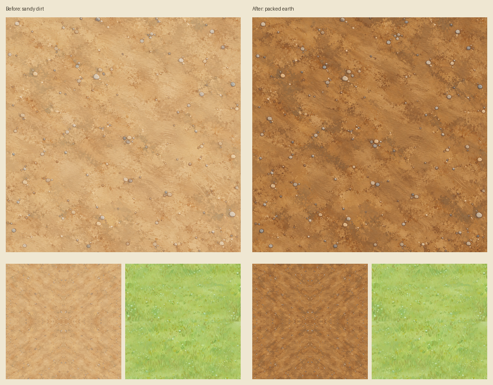
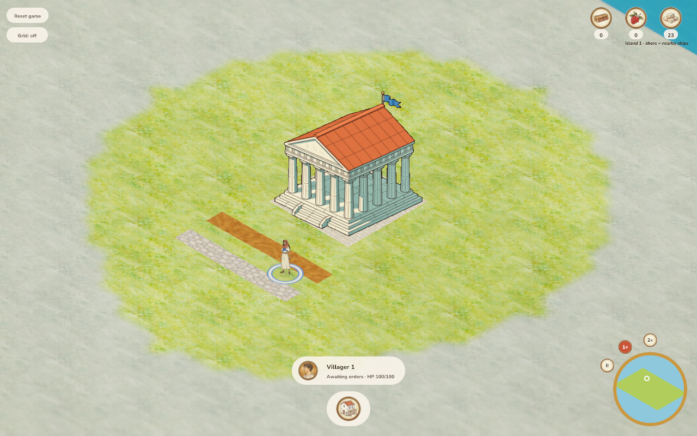
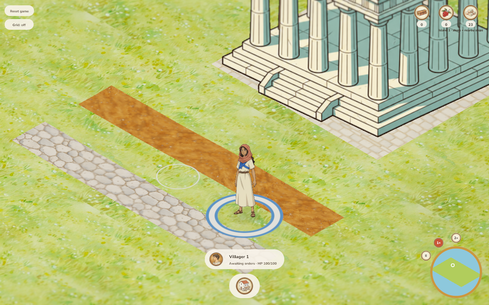
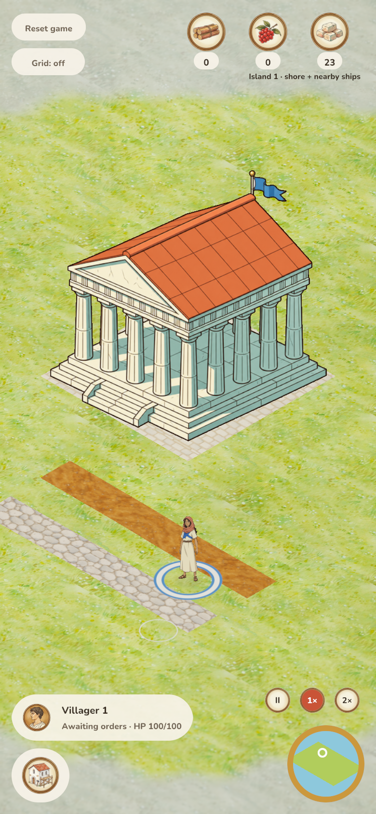
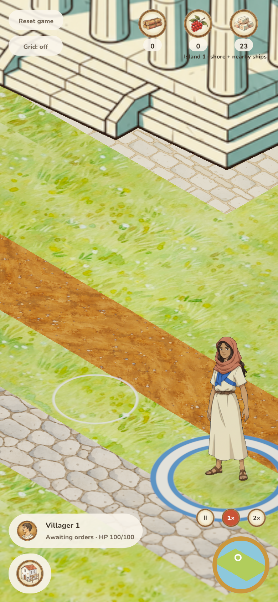

# Dirt road readability — 2026-10-06

The user requested recreation because the sandy dirt road was hard to see.
The replacement deepens the surface to muted ochre-brown packed earth with
clearer shallow painted variation and sparse finely outlined pebbles. Only the
dirt runtime texture changes; road construction, movement, stone paving, biomes,
plots and mirrored mip-clamped sampling retain their existing behavior.

## Sources

[Exact prompt, reference revision/hashes and output hash](../../../../assets/terrain/road_sources/dirt-readability.provenance.json).
The previous 1254×1254 PNG is retained in
`assets/terrain/road_sources/dirt-sandy-before.png`. The new generated original
is copied unchanged into the runtime path, also 1254×1254 opaque RGB PNG.
The primary diorama and meadow are the approved world references; the previous
dirt is the edit target.

## Review

- Ink: fine brown pebble contours remain restrained; no heavy black edges.
- Color: deeper muted earthy ochre-brown visibly separates the road from the
  yellow-green meadow; no saturated red/orange clay.
- Light/material: soft painted variation and shallow scuffs, with no glossy relief
  or hard shadow bands.
- Shape/detail: sparse pebbles keep the compacted soil dominant.
- Camera/scale: pass on desktop and emulated DPR2 phone at default and maximum
  zoom; fine pebbles stay subordinate to villagers and soil remains readable.
- Integration: pass, with clear separation from yellow-green meadow and neutral
  limestone paving, and no visible cell gaps or mirrored repeat seams. Opaque
  terrain makes cutout/alpha fringe checks inapplicable.

## Verification

Formatting, 294 workspace tests (one existing ignored benchmark) and the
303-frame sprite-resolution audit pass. Native/WASM strict lint and rebuilt
web/server pass. Desktop mouse and emulated DPR2 phone touch construction each
complete 14 cells and charge exactly seven stone, with no page errors. PNG
signature, opaque RGB, resolution, retained-original equality and unchanged stone
bytes pass; [checks](checks.json) and [runtime/asset hashes](results.json) identify
the checked output. Screenshot dimensions are verified as 1280×800 desktop and
780×1688 phone (390×844 logical pixels at DPR2).

Physical phone and native-window rendering are unverified. Maximum phone zoom
uses anchored wheel input after the touch construction replay. The rebuilt WASM
and server are byte-identical to the previous stone-review binaries; this change
is fetched as a runtime texture. User approved this result and authorized merge on 2026-10-06. Release status is
tracked by the production workflow after integration.

Reproduce with `python3 docs/verification/check_roads.py --output /tmp/dirt-road-review`
after rebuilding the current server, fixture and browser client. The executor's
cached debug server predated island-local saves and rejected the current fixture;
that initial attempt produced no gameplay evidence. The current-source rebuild
fixed it, and the complete replay passes.

## Code-quality review

One runtime image replacement, retained source and focused provenance/review
updates. No code abstraction, dependency, simulation state, save version or input
behavior is added. Style and gameplay visibility now pass; no broader product or gameplay change
is needed.

## Gameplay captures

## Authorized merge verification

The user approved the result and authorized merge on 2026-10-06. PR #150
integrates master `9919648`, preserving stationary status feedback, boars,
gathering-safe building selection and connected road resumption. Combined checks
pass: 299 workspace tests (one existing benchmark ignored), formatting, strict
native/WASM lint, rebuilt web/server/fixture, 307-frame/field/transport/icon
audits, six release-verifier tests, and desktop mouse/DPR2 phone touch road
construction with 14 cells and exactly seven stone charged, without page errors.
[Combined bundle/server and material hashes](merge-results.json) identify this
replay; it repeats construction without new screenshots. The approved normal/
maximum-zoom captures above retain their original bundle hashes. The dirt image
is unchanged from user review, and the only runtime diff from master is that image.

Merge/release state is tracked by [PR #150](https://github.com/koogle/age-of-agents/pull/150)
and its merge-triggered production workflow.
