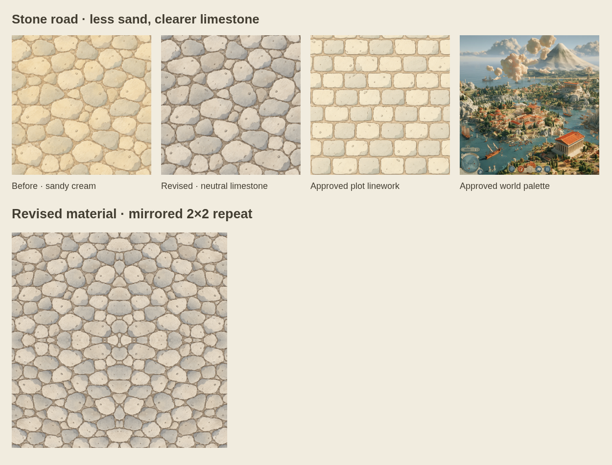
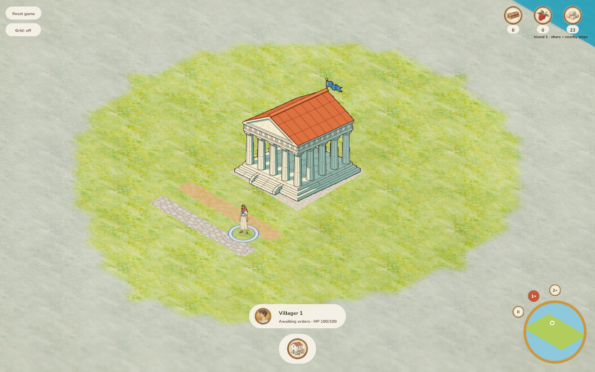
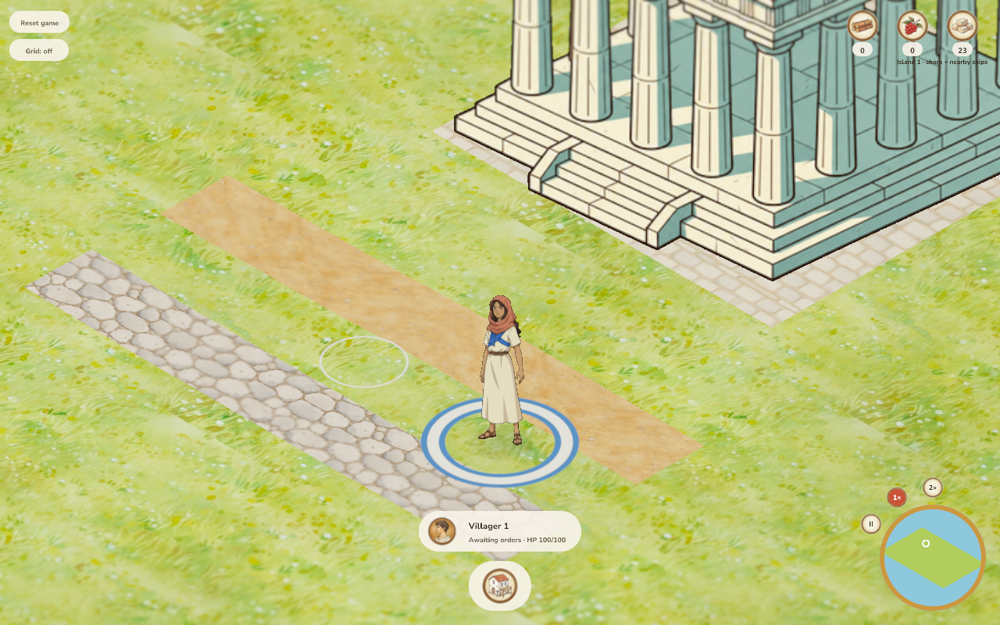
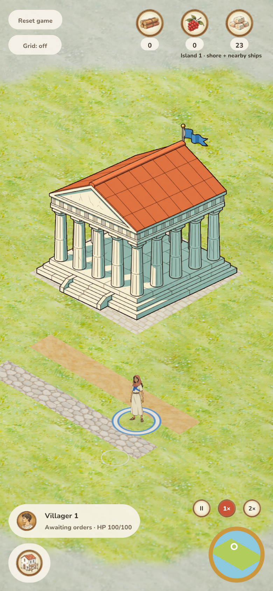
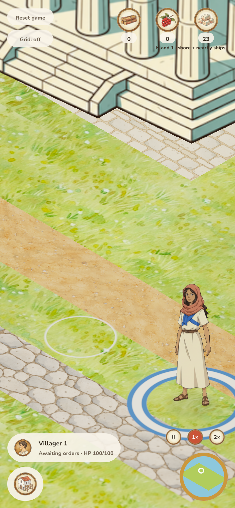

# Stronger limestone road material — 2026-10-06

Jakob found the merged stone road too sandy and asked for slightly stronger
material definition. After seeing the revised texture and before/after comparison,
he confirmed: “yeah I prefer that.” The revision reduces yellow/ochre, keeps ivory
highlights and strengthens neutral-grey face shading and fine grey-brown joints.
The irregular arrangement and scale stay consistent. Dirt and building plots are
unchanged, as are construction, costs, pathfinding and movement bonuses.

## References and provenance

OpenAI image_gen edited the existing road material with the approved plot paving
and primary world diorama attached as style references. The original sandy pass
is retained at `assets/terrain/road_sources/stone-sandy-before.png`.
[Exact prompt, source hashes and output provenance](../../../../assets/terrain/road_sources/stone-contrast.provenance.json)
identify the single unmodified 1254×1254 PNG refinement. Runtime sampling remains
512px with mipmaps and the existing mirrored edge clamping.



[Comparison source](comparison.html) includes a mirrored repeat preview. Mirrored
stone shapes remain an accepted small-scale repetition; no new seam strategy or
shader changes were introduced.

## Style review

| Criterion | Result and observation |
| --- | --- |
| Ink | Pass: thin grey-brown joints have slightly clearer separation without heavy black outlines. |
| Color | Pass: pale neutral limestone and ivory replace yellow sand; shading avoids blue slate. User prefers this version. |
| Light/material | Pass: soft cel shadow planes and painted face texture remain matte; no glossy bevel or photographic relief. |
| Shape/detail | Pass: the same irregular cobble arrangement and sparse chips remain readable. |
| Camera/scale | Pass: unchanged overhead scale; stones and fine joints remain legible at gameplay and maximum zoom on desktop and DPR2 phone. |
| Integration | Pass: stone is clearly distinct from dirt, no visible gaps at cell/repeat boundaries, and plots/terrain remain untouched. Opaque terrain makes sprite alpha/fringe checks inapplicable. |

## Reproduce

```bash
cargo build -p age-of-agents --locked
cargo build -p aoa-game --example roads_fixture --locked
python3 docs/verification/check_roads.py --output /tmp/stone-contrast
```

Build the server and fixture for the checked-out revision before starting the
isolated browser check; the current base uses save version 16 and riverbank water.
This asset-only change does not modify the save schema or need a new WASM build.
The checked-in master bundle is used with the replacement PNG fetched at startup.
The first local attempt was stopped when the older server/fixture binaries were
noticed; only the rerun with current binaries is retained as verification.

## Automated verification

294 workspace tests pass (one existing manual benchmark ignored). Formatting,
strict native/WASM lint and sprite-resolution, field/transport and icon audits
pass. The replacement is a valid opaque 1254×1254 RGB PNG.

Desktop mouse and DPR2 phone touch construction both pass: 14 completed cells,
seven stone charged and zero browser errors. Normal/max-zoom screenshots were
reviewed on both viewports. [Build and material hashes](results.json) identify
the exact checked assets.

## Review scope

One runtime texture is replaced, with its old version and generation provenance
retained. No code, dependency, game rule, save version or balance change.
Documentation links and historical comparison sources now point to the retained
old material, so prior evidence remains reproducible. Physical phones and native
window rendering remain unverified; phone captures emulate DPR2.








