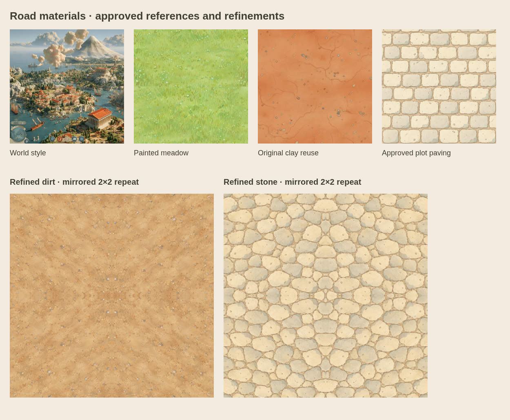
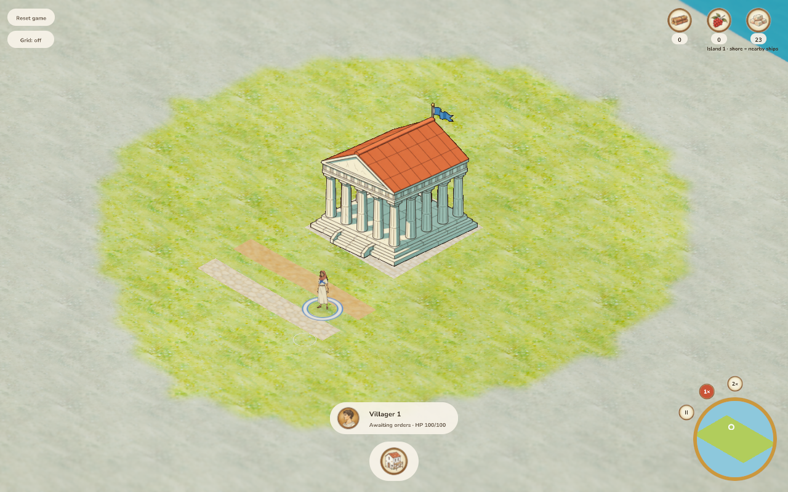
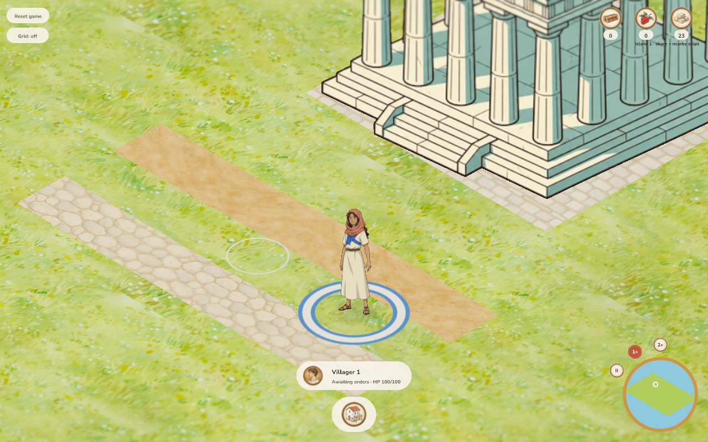
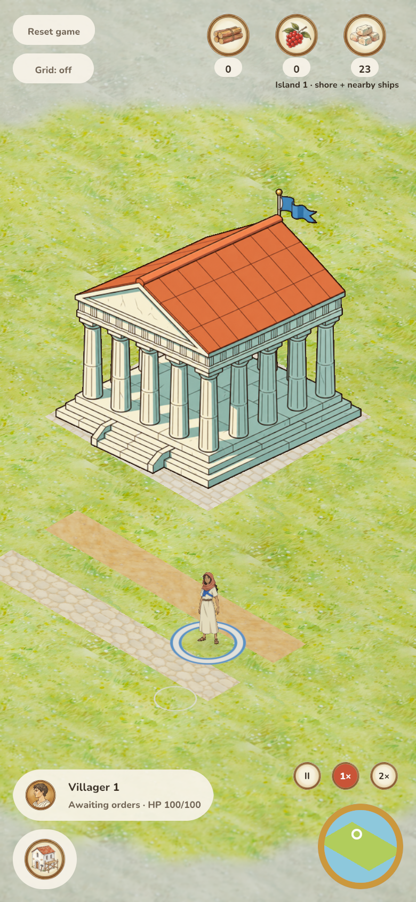
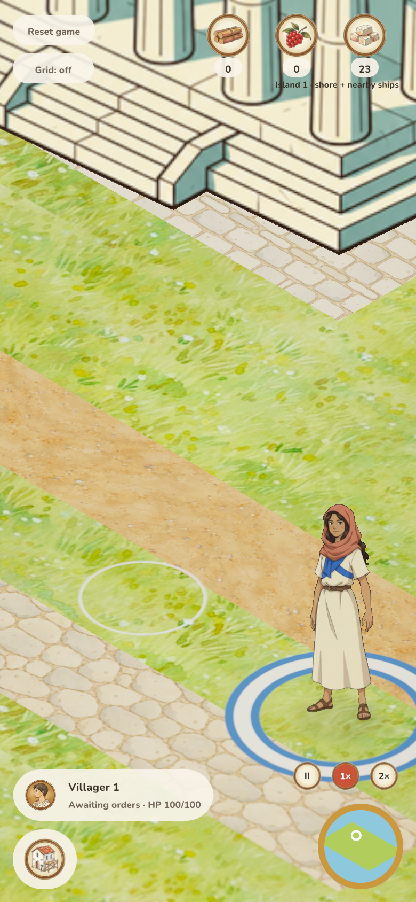

# Road material refinement — 2026-10-06

Jakob asked for both road textures to match the game style more closely after
reviewing PR #133. Dirt now uses worn sandy ochre gouache instead of orange clay;
stone uses irregular warm limestone instead of the regular building-plot grid.
Gameplay, placement, costs and speed are unchanged.

## Sources and comparison

The exact approved reference revision, hashes, ordered references, full prompts
and generated originals are recorded in [provenance](../../../../assets/terrain/roads.provenance.json).
Both refinements were made with OpenAI image_gen, attaching the primary diorama,
painted meadow and their respective original clay/paving image. The unmodified
1254×1254 PNGs are retained as [dirt](../../../../assets/terrain/road_dirt.png) and
[stone](../../../../assets/terrain/road_stone.png). There are no additional art passes.



[Comparison source](comparison.html) uses the renderer's mirrored 2×2 arrangement.
The source images are not assumed seamless. Mirroring makes every repeat meet at
identical texels; mip-level clamping prevents opposite-edge filtering. Small
symmetric pebble/stone details at reflection lines are an accepted limitation.

## Style review

| Criterion | Result and observation |
| --- | --- |
| Ink | Pass: small pebbles and stone joints use delicate warm-brown contours comparable to the approved paving; no heavy black edging. |
| Color | Pass: dirt replaces saturated clay orange with sandy ochre; stone keeps cream and muted warm grey within the limestone family. |
| Light/material | Pass: visible gouache strokes, shallow two-tone stone shading and no glossy bevel or photographic relief. |
| Shape/detail | Pass: sparse earth pebbles and irregular hand-laid cobbles; road material is distinct from the regular plot grid. |
| Camera/scale | Pass: desktop and DPR2 phone preserve world scale at gameplay and maximum zoom; cobbles remain smaller than a villager and earth details stay subordinate. |
| Integration | Pass: no visible cell gaps or repeat seams in either viewport; roads stay legible beside the existing plots. Opaque ground materials make alpha/fringe checks inapplicable. Building plots and biome images are unchanged. |

## Verification

Both desktop mouse and DPR2 phone touch construction pass: 14 completed cells,
seven stone charged, no browser errors. [Build and asset hashes](results.json)
identify the checked versions.

282 workspace tests pass (one existing manual benchmark ignored), native/WASM
strict lint and formatting pass, and the release browser bundle is rebuilt.
Sprite-resolution, field/transport and icon-normalization checks pass. The two
new files have valid PNG signatures, opaque RGB pixels and 1254×1254 resolution;
the existing texture uploader generates a 512×512 mipmapped array.

Reproduce construction and captures with:

```bash
python3 docs/verification/check_roads.py --output /tmp/roads-style
```

The driver uses an isolated server/save, places seven cells of each material via
real mouse/touch commands, verifies labour/costs and captures default and maximum
zoom. Maximum zoom is reached with three anchored wheel inputs (the camera clamps
at distance 5); the phone captures emulate DPR2 and touch construction, while the
zoom step uses a wheel event. Physical phones and the native window are unverified.

## Code review

Two extra material layers in the existing terrain texture array replace the clay
reuse and shared paving sample for roads. One selected road layer and one sample
handle completed and unfinished roads. No new dependency, gameplay state,
persistence version, interaction mode or renderer abstraction. Existing biome
indices and plot layer 10 remain stable. The renderer remains under 1,000 lines.

## Gameplay captures








