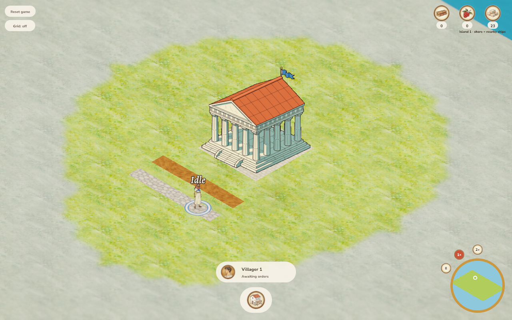
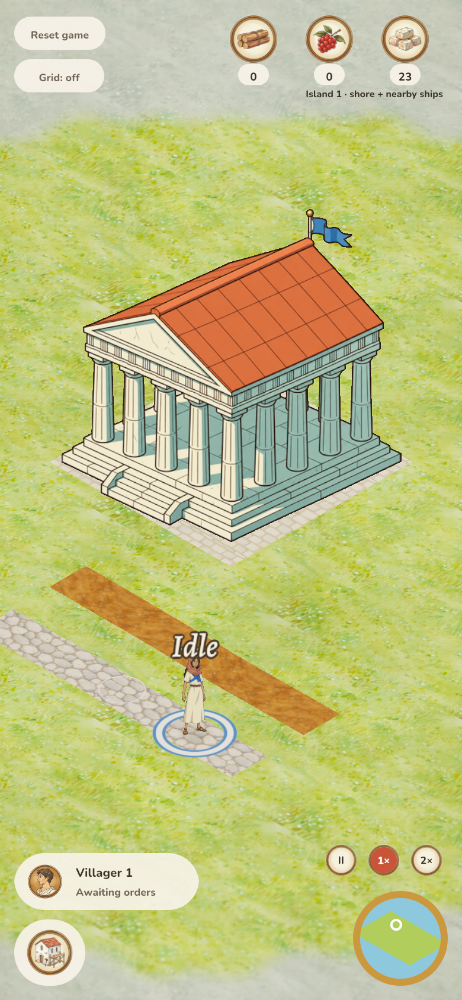

# Test/tooling subtraction — 2026-10-06

Implemented on `codex/reduce-tests-tooling`, integrated with master `a8188f1`.
[Draft PR #153](https://github.com/koogle/age-of-agents/pull/153) is pushed; not merged or deployed. Jakob requested substantial source reduction,
including repetitive tests/fixtures and Python tooling.

## Measured savings

| Tracked source | Before | After | Net removed |
| --- | ---: | ---: | ---: |
| Python | 5,716 | 3,873 | 1,843 (32.2%) |
| Rust | 26,759 | 26,543 | 216 (0.8%) |
| Combined | 32,475 | 30,416 | 2,059 (6.3%) |

These are physical lines including comments and tests, counted from the base Git
tree versus existing files. No source was moved to another language or generated
file to inflate savings. Python falls from 74 files to 42. The earlier 40% figure
used the original `1984e9b` checkout; upstream additions change the denominator.
The newly updated wildlife-pose replay is retained for boar verification.

The 32 retired Python scripts are historical batch generators, contact-sheet
helpers, obsolete asset processing and dated feature-specific screenshot drivers.
[The retirement record](../RETIRED_TOOLS.md) lists every path, retained tools and
exact Git recovery. Original art, provenance and recorded results remain; retired
capture commands are historical and not maintained checks.

The mechanics fixture now uses flat terrain and fixed patches instead of a second
Voronoi/resource generator. Resource IDs, order and cell geometry are preserved.
Three tests of that synthetic generator were removed; real world-generation
and gameplay tests remain. The added save-failure regression is retained.

The earlier Rust refactor shares the resource catalog, building capabilities,
eligibility, costs, worker validation, interpolation and GPU binding setup.
Hosted commands clone once instead of twice; no runtime speedup is claimed.
The wire envelope stays unchanged: domain formatting emits friendly rejection
copy directly, including the new upstream unit-correlated overhead feedback.

## Verification

- 301 integrated workspace tests pass: 14 server, 101 client, 186 game; one existing
  manual benchmark remains ignored. The new server test forces an actual SQLite
  write failure and verifies unchanged state/no publication, then successful commit.
- Final integrated formatting, strict native/WASM lint and native/web rebuilds pass.
- Six release-verifier tests, 307-frame sprite resolution, field-preparation,
  transport and icon-normalization checks pass. Retained Python sources compile.
- Final integrated desktop mouse/DPR-2 touch replay passes with no page errors. Use the driver in
  [road verification](../roads/README.md), with isolated temporary SQLite saves.
  It checks two road orders, 14 completed cells and exactly seven stone charged.
  On this macOS host, only the Chromium launch is adapted to `channel='chrome'`.
- The first Modal release attempt was interrupted during image build, before
  activation. This integrated cleanup is not deployed. The available production
  profile is `koogle-frick`; the default `radiantai` must not be used.

The temporary environment supplies aiohttp, Playwright, Pillow/numpy and Modal
1.5.3; web builds use wasm-bindgen CLI 0.2.129 matching the lockfile. No repository
dependency changes. Physical phones and native-window appearance remain untested.

## Thermonuclear review

Applied [the game's review](../../THERMONUCLEAR_REVIEW.md). Removed a synthetic
fixture generator and its self-tests; no gameplay, original art, provenance,
active offline packers or domain safety checks are deleted. Historical script
retirement is explicit and recoverable. Retained driver code is not ported into
another language or hidden in generated output. No new framework/dependency.

The integrated source preserves boars, connected-road resumption, new menu/error
feedback, stationary statuses and overhead health bars. Shared domain helpers
preserve atomic rejection, queue precedence, discovery, island costs/refunds and
route ownership. GPU binding order/views/layout/filtering stay unchanged. Changed
client files remain below 1,000 lines.

Save version 17 resets earlier hosted development saves because authoritative
building capability vectors were removed. Snapshot offers retain their shape.
Matching-version saves persist and current corruption remains an error.

