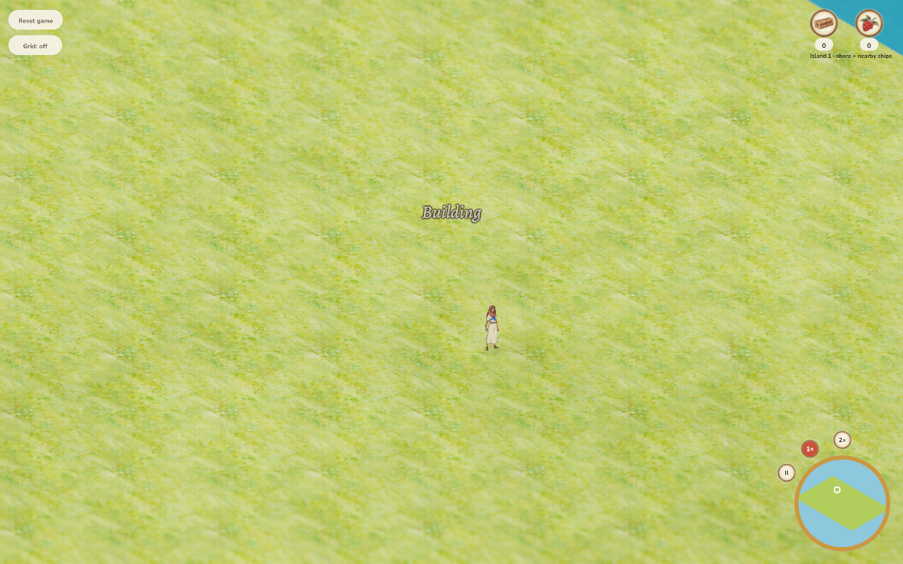

# Stationary NPC status feedback — 2026-10-06

Status messages retain the world position where they first appear and rise/fade
for the existing 1.4 seconds. New orders replace the old announcement at the
NPC's current position. Damage labels retain their existing movement tracking.
No simulation, save, input or artwork change.

Reproduce after rebuilding the browser client:

```bash
python docs/verification/replay_status.py --output docs/verification/status-feedback
```

The loopback replay uses the current-schema presentation fixture, a paused
Playwright clock and real WebGL HUD uploads. A building assignment generates
feedback; the villager then moves four cells in X and two in Y. It checks a
fixed horizontal glyph anchor, upward motion, decreasing opacity and expiry
on desktop (1280×800, DPR1) and emulated phone (390×844, DPR2). It captures
screenshots without advancing the clock. This isolates presentation; it does
not claim authoritative construction acceptance or physical-phone/native-window
appearance. Both viewport checks pass without page errors; [recorded samples and bundle hash](results.json).



[Initial desktop frame](desktop-start.png) · [Expired desktop frame](desktop-expired.png) · [Phone after movement](phone-moved.png)

Code-quality review: one presentation flag separates replacement identity from
movement tracking; no new dependency, simulation logic, renderer layer or input
path. The existing rapid-order and label-count bounds remain intact. Regression
coverage checks both world axes, replacement at a new position and preserved
damage tracking. Workspace tests pass (294 combined tests, one existing ignored benchmark),
and strict native/WASM lint passes. Integrated master `1984e9b`, preserving stronger wildlife and refined stone-road/disembark artwork. Release WebGL rebuild, asset audits, six release-verifier tests and refreshed desktop/phone browser checks pass. User authorized PR creation and merge on 2026-10-06; production uses the merge-triggered workflow. Direct Modal access remains unavailable.
